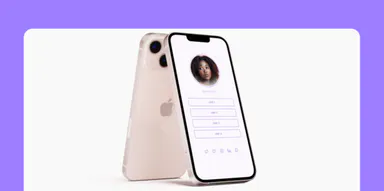

</img>

<h1 align="center">Social Links</h1>

Esse projeto foi proposto como desafio pela <a href="https://github.com/Rocketseat">@Rocketseat</a>. O objetivo é criar uma página com links sociais que levam para diferentes redes sociais.

## 🛠 &nbsp; Tecnologias usadas
&nbsp;
&nbsp;

<h3>Como o projeto ficará:</h3>

